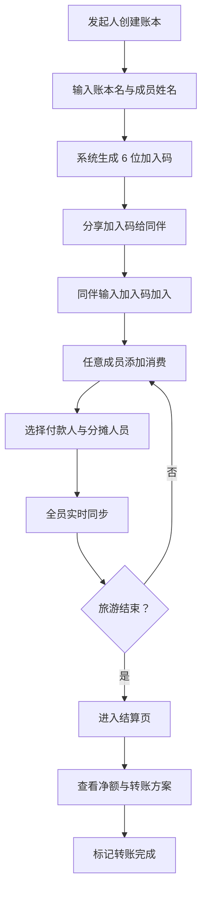

# 旅游分账 — 产品需求文档（PRD）

## 1. 产品概述
一款面向中国大陆多人旅游场景的实时分账工具，每位参与者可在自己手机上记账，自动同步、自动计算每人应付/应收及最终最优转账方案，解决旅游归来算账混乱、AA 拖延的痛点。
- 目标用户：结伴出游的朋友/同事/家庭（2-10 人小团体）
- 核心价值：实时同步、零记账摩擦、一键生成"谁给谁转多少"的结算方案

## 2. 核心功能

### 2.1 功能模块
1. **首页（账本页）**：账本列表、创建新账本、加入已有账本
2. **账本详情页**：成员管理、消费记录时间线、汇总概览、添加消费入口
3. **添加消费页**：金额输入、付款人选择、分摊人员多选、消费目的（分类标签 + 备注）
4. **结算页**：每人消费明细矩阵、每人净额、最少转账路径方案

### 2.2 页面详情

| 页面名称 | 模块名称 | 功能描述 |
|---------|---------|---------|
| 首页 | 账本卡片列表 | 显示近期账本（标题、人数、总金额、未结算数），点击进入 |
| 首页 | 创建账本 | 输入账本名（如"海南五日游"），添加成员姓名（最少 2 人），生成 6 位加入码 |
| 首页 | 加入账本 | 输入 6 位加入码，自动拉取账本信息和成员列表 |
| 账本详情 | 成员栏 | 横向头像列表显示所有成员（彩色首字母头像），可增删成员 |
| 账本详情 | 汇总卡片 | 总消费金额、笔数、最大单笔、待结算金额 |
| 账本详情 | 消费时间线 | 倒序显示每笔消费：付款人头像、金额、目的、分摊人数、时间 |
| 账本详情 | 添加消费 FAB | 右下角浮动按钮，点击进入添加消费页 |
| 添加消费 | 金额输入 | 大字号数字键盘输入，元为单位，保留两位小数 |
| 添加消费 | 付款人选择 | 单选成员头像列表 |
| 添加消费 | 分摊人员 | 多选成员头像（默认全选），实时显示"每人 ¥X.XX" |
| 添加消费 | 消费目的 | 标签云（餐饮/住宿/交通/门票/购物/其他）+ 自定义备注 |
| 添加消费 | 保存按钮 | 保存后实时同步到所有成员，返回详情页 |
| 结算页 | 净额榜 | 每人"已付/应付/净额"卡片，净额正绿负红 |
| 结算页 | 转账方案 | 最少转账算法结果："张三 → 李四 ¥128.50"卡片列表，可标记已转账 |
| 结算页 | 消费矩阵 | 二维表：行=付款人，列=收款人，单元格=该笔分摊金额 |

## 3. 核心流程

### 3.1 创建并参与账本流程
1. 发起人创建账本 → 输入账本名 → 添加成员姓名 → 系统生成 6 位加入码
2. 其他成员打开 App → 输入加入码 → 自动加入账本
3. 任意成员添加消费 → 选择付款人/分摊人员 → 全员实时同步
4. 旅游结束 → 进入结算页 → 查看转账方案 → 标记完成转账

### 3.2 流程图

## 4. 用户界面设计

### 4.1 设计风格
**主题：复古旅行明信片**
- 主色：沙漠橙 `#E07A3E`（夕阳/邮戳感）
- 辅色：墨绿 `#2D5A4A`（护照/复古地图）
- 中性色：米白 `#F5EFE3`（明信片纸）、深褐 `#3A2E1F`（文字）
- 强调色：朱红 `#C8442C`（邮戳/重要金额负值）
- 字体：标题用"霞鹜文楷"或"LXGW WenKai"（手写感），正文用"思源黑体"
- 圆角：12px（卡片），按钮 24px（胶囊）
- 图标：线性旅行图标（飞机、行李箱、餐叉、钥匙、票根）
- 装饰：虚线边框（明信片邮票感）、邮戳圆形徽章、纸张纹理背景

### 4.2 页面设计概览

| 页面名称 | 模块名称 | UI 元素 |
|---------|---------|---------|
| 首页 | 顶部标题 | "我的旅程"手写字标题 + 复古装饰线 |
| 首页 | 账本卡片 | 米白纸质感卡片，虚线边框，左上角邮戳日期，标题+人数+总金额 |
| 首页 | FAB | 圆形橙色"+"按钮，右下角悬浮 |
| 账本详情 | 顶部账本信息 | 账本名 + 创建日期 + 总金额大字 |
| 账本详情 | 成员头像栏 | 横向滚动彩色圆形头像（首字母） |
| 账本详情 | 消费时间线卡片 | 左侧付款人头像，右侧金额（橙色大字）+ 目的标签 + 分摊人小头像堆叠 |
| 添加消费 | 金额输入区 | 居中大字号 ¥XXX.XX，下方数字键盘 |
| 添加消费 | 付款人选择 | 横向头像列表，选中态橙色描边 + 对勾 |
| 添加消费 | 分摊人员 | 头像网格，选中态填充色，顶部显示"每人 ¥X.XX"实时计算 |
| 添加消费 | 目的标签 | 胶囊形彩色标签横向滚动 |
| 结算页 | 净额卡片 | 大字号金额，正绿负红，右侧箭头指示方向 |
| 结算页 | 转账方案卡 | "A → B"头像对，金额居中，复选框标记完成 |

### 4.3 响应式
**Mobile-first 设计**：所有页面以 375px 宽度为基准设计，最大宽度 480px 居中。桌面访问时居中显示手机宽度容器，两侧留白装饰（如虚线、邮戳）。所有交互元素 ≥ 44px 触控热区。

### 4.4 动效
- 卡片入场：staggered fade-up，每张延迟 80ms
- 数字变化：CountUp 动画（金额变动）
- 添加消费成功：FAB 缩放反馈 + 卡片从顶部滑入
- 实时同步提示：顶部 toast"张三 添加了一笔消费"
- 头像选中：弹跳缩放反馈
