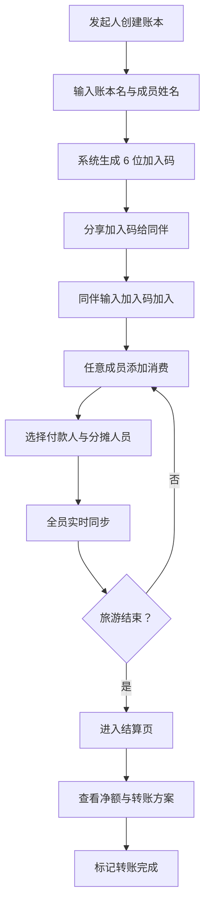

# 旅游分账 — 产品需求文档（PRD）

## 1. 产品概述

一款面向中国大陆多人旅游场景的实时分账 + 旅游协作工具。每位参与者可在自己手机上记账，自动同步、自动计算每人应付/应收及最终最优转账方案，解决旅游归来算账混乱、AA 拖延的痛点。同时提供行程规划、行李清单、信息共享、投票等旅游辅助功能。

- **目标用户**：结伴出游的朋友/同事/家庭（2-10 人小团体）
- **核心价值**：实时同步、零记账摩擦、一键生成"谁给谁转多少"的结算方案
- **访问方式**：手机浏览器直接访问，PWA 可安装到主屏幕，无需下载 App

## 2. 核心功能

### 2.1 功能模块

#### 记账分账
1. **首页（账本页）**：账本列表、创建新账本、加入已有账本、设置入口
2. **账本详情页**：成员管理、消费记录时间线、汇总概览、添加消费入口、账本编辑/删除
3. **添加/编辑消费页**：金额输入、付款人选择、分摊人员多选、消费目的（分类标签 + 备注）
4. **结算页**：每人消费明细矩阵、每人净额、最少转账路径方案

#### 账单 OCR 识别
5. **识别导入**：上传账单截图 → AI 自动识别金额/目的/日期/付款人 → 每项可单独指定付款人 → 批量导入

#### 旅游辅助
6. **行程规划**：按天分组安排景点/餐饮/交通/住宿
7. **行李清单**：分类勾选，全员实时同步
8. **共享信息板**：航班/酒店/联系人/紧急信息卡片
9. **投票功能**：多人投票决策（单选/多选）

#### 体验增强
10. **PWA 安装**：适配微信/QQ/UC/小米/华为/OPPO/vivo 等主流手机浏览器
11. **深色模式**：手动切换 + 跟随系统
12. **数据导出**：导出图片（便于分享）+ 文本（便于复制）
13. **消费记录操作**：编辑/复制/删除

### 2.2 页面详情

| 页面名称 | 模块名称 | 功能描述 |
|---------|---------|---------|
| 首页 | 账本卡片列表 | 显示近期账本（标题、人数、总金额、未结算数），点击进入 |
| 首页 | 创建账本 | 输入账本名（如"海南五日游"），添加成员姓名（最少 2 人），生成 6 位加入码 |
| 首页 | 加入账本 | 输入 6 位加入码，自动拉取账本信息和成员列表 |
| 首页 | 设置入口 | 齿轮图标：深色模式切换、PWA 安装指引 |
| 账本详情 | 成员栏 | 横向头像列表显示所有成员（彩色首字母头像），可增删成员 |
| 账本详情 | 汇总卡片 | 总消费金额、笔数、最大单笔、待结算金额 |
| 账本详情 | 消费时间线 | 倒序显示每笔消费：付款人头像、金额、目的、分摊人数、时间、编辑/复制/删除按钮 |
| 账本详情 | 添加消费 FAB | 右下角浮动按钮，点击进入添加消费页 |
| 账本详情 | 识别导入 | Header 右上角按钮，上传账单截图 AI 识别 |
| 账本详情 | 导出 | Header 右上角按钮，导出图片或文本 |
| 账本详情 | 账本设置 | 齿轮图标：编辑账本名、改成员名、加/删成员 |
| 账本详情 | 行程规划 | 按天分组的行程卡片，可添加/编辑/删除行程项 |
| 账本详情 | 行李清单 | 分类行李项，勾选/取消，实时同步 |
| 账本详情 | 共享信息板 | 航班/酒店/联系人/紧急信息卡片 |
| 账本详情 | 投票 | 创建投票、投票、查看结果 |
| 添加消费 | 金额输入 | 大字号数字键盘输入，元为单位，保留两位小数 |
| 添加消费 | 付款人选择 | 单选成员头像列表 |
| 添加消费 | 分摊方式 | 平均 / 自定义金额 / 付款人独担 |
| 添加消费 | 分摊人员 | 多选成员头像（默认全选），实时显示"每人 ¥X.XX" |
| 添加消费 | 消费目的 | 标签云（餐饮/住宿/交通/门票/购物/其他）+ 自定义备注 |
| 添加消费 | 保存按钮 | 保存后实时同步到所有成员，返回详情页 |
| 识别导入 | 上传图片 | 选择或拍摄账单截图 |
| 识别导入 | AI 识别结果 | 列表显示识别的消费项，每项可编辑目的/金额/付款人 |
| 识别导入 | 重复检测 | 自动检测已有消费，标记疑似重复 |
| 识别导入 | 批量导入 | 一键导入所有选中项，每项用自己的付款人 |
| 结算页 | 净额榜 | 每人"已付/应付/净额"卡片，净额正绿负红 |
| 结算页 | 转账方案 | 最少转账算法结果："张三 → 李四 ¥128.50"卡片列表 |
| 结算页 | 消费矩阵 | 二维表：行=付款人，列=收款人，单元格=该笔分摊金额 |

## 3. 核心流程

### 3.1 创建并参与账本流程
1. 发起人创建账本 → 输入账本名 → 添加成员姓名 → 系统生成 6 位加入码
2. 其他成员打开 App → 输入加入码 → 自动加入账本
3. 任意成员添加消费 → 选择付款人/分摊人员 → 全员实时同步
4. 旅游结束 → 进入结算页 → 查看转账方案 → 标记完成转账

### 3.2 账单 OCR 识别流程
1. 点击"识别导入"按钮 → 上传账单截图
2. AI 自动识别金额、目的、日期、付款人
3. 每项可单独修改付款人（默认付款人批量设置）
4. 检测重复消费（防止重复导入）
5. 点击导入 → 批量写入数据库 → 全员实时同步

### 3.3 流程图

## 4. 用户界面设计

### 4.1 设计风格
**主题：复古旅行明信片**
- 主色：沙漠橙 `#E07A3E`（夕阳/邮戳感）
- 辅色：墨绿 `#2D5A4A`（护照/复古地图）
- 中性色：米白 `#F5EFE3`（明信片纸）、深褐 `#3A2E1F`（文字）
- 强调色：朱红 `#C8442C`（邮戳/重要金额负值）
- 字体：标题用"霞鹜文楷"或"LXGW WenKai"（手写感），正文用"思源黑体"
- 圆角：12px（卡片），按钮 24px（胶囊）
- 图标：线性旅行图标（飞机、行李箱、餐叉、钥匙、票根）
- 装饰：虚线边框（明信片邮票感）、邮戳圆形徽章、纸张纹理背景

### 4.2 弹窗设计
- 所有弹窗从屏幕底部升起（非居中），符合移动端操作习惯
- 右上角"取消"按钮（药丸形 + X 图标），触控热区 ≥ 44px
- 半透明遮罩点击可关闭
- ESC 键可关闭（桌面端）
- 使用 React Portal 渲染到 document.body，避免祖先 backdrop-blur 影响 fixed 定位

### 4.3 响应式
**Mobile-first 设计**：所有页面以 375px 宽度为基准设计，最大宽度 480px 居中。桌面访问时居中显示手机宽度容器，两侧留白装饰（如虚线、邮戳）。所有交互元素 ≥ 44px 触控热区。

### 4.4 动效
- 卡片入场：staggered fade-up，每张延迟 80ms
- 弹窗入场：slide-in-bottom（从底部上滑 16px）
- 头像选中：弹跳缩放反馈
- 实时同步：数据变化时自动刷新，无需手动操作

### 4.5 深色模式
- 跟随系统：自动检测 `prefers-color-scheme`
- 手动切换：设置面板可选浅色/深色/跟随系统
- 存储：`localStorage.travel-split:theme`
- 实现：CSS 变量 + Tailwind dark class

## 5. PWA 安装

### 5.1 安装方式（按浏览器分类）
| 浏览器 | 安装方式 |
|--------|---------|
| iOS Safari | 分享按钮 → 添加到主屏幕 |
| Android Chrome | 菜单 ⋮ → 添加到主屏幕 |
| 微信内置 | 先"在浏览器中打开" → 再按上述步骤 |
| QQ 浏览器 | 菜单 ☰ → 添加到桌面 |
| UC 浏览器 | 菜单 ☰ → 添加到主屏幕 |
| 小米浏览器 | 菜单 ☰ → 添加到主屏幕 |
| 华为浏览器 | 菜单 ☰ → 添加到主屏幕 |
| OPPO/vivo 浏览器 | 菜单 ☰ → 添加到主屏幕 |

### 5.2 提示策略
- 首页加载 4 秒后弹出底部提示条"添加到主屏幕"
- 点击"查看"打开设置面板的安装指引
- 7 天内点过关闭不再重复提示
- 已安装（display-mode: standalone）不显示提示

## 6. 技术依赖

| 技术 | 用途 |
|------|------|
| Next.js 14.2.x | App Router 框架 |
| TypeScript | 类型安全 |
| Tailwind CSS v3 | 样式（复古明信片主题） |
| Supabase | PostgreSQL + Realtime |
| GLM-4V-Plus | 账单 OCR 多模态识别 |
| Cloudflare Pages | 静态托管 + Functions |
| html2canvas | 数据导出图片 |
| lucide-react | 图标库 |

## 7. 关键约束

- 金额单位：元（人民币 CNY），保留 2 位小数
- 分摊方式：equal（平均）/ custom（自定义金额）/ solo（付款人独担）
- 加入码：6 位大写字母数字（约 21 亿组合）
- 静态导出：`output: 'export'`，所有页面为 client component
- 无用户登录系统：通过加入码控制访问（用户量增长后可升级为 Supabase Auth）
- 数据实时性：依赖 Supabase Realtime，离线时无法记账（壳层可离线访问）
