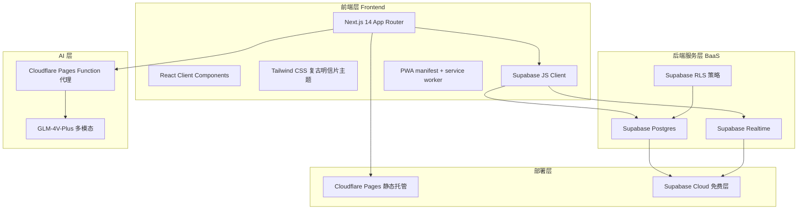
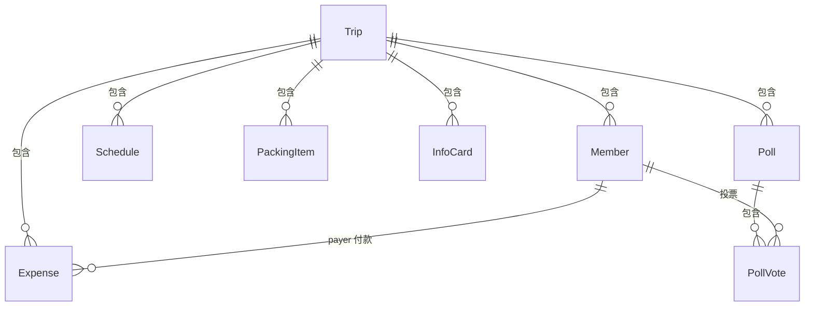

# 旅游分账 — 技术架构文档

## 1. 架构设计



## 2. 技术说明

- **前端框架**：Next.js 14.2.x（App Router）+ TypeScript
- **样式**：Tailwind CSS v3 + 手写组件（不使用 shadcn CLI），复古明信片主题
- **状态管理**：React Hooks（useState/useEffect）+ Supabase Realtime 订阅
- **后端 BaaS**：Supabase（PostgreSQL + Realtime + RLS）
- **实时同步**：Supabase Realtime postgres_changes 订阅（trips/members/expenses/schedules/packing_items/info_cards/polls/poll_votes）
- **认证方式**：匿名访问 + 加入码（6 位大写字母数字），无密码无注册
- **数据持久化**：Supabase Postgres（云端唯一数据源）+ localStorage（本地账本引用列表）
- **离线缓存**：PWA service worker（网络优先 + 缓存回退策略）
- **AI OCR**：GLM-4V-Plus 多模态模型（通过 Cloudflare Pages Function 代理调用）
- **PWA**：manifest.webmanifest + sw.js，支持全主流手机浏览器安装
- **部署**：Cloudflare Pages 静态导出（output: 'export'）+ Pages Functions
- **包管理**：npm

## 3. 路由定义

| 路由 | 用途 |
|------|------|
| `/` | 首页：账本列表 + 创建/加入入口 + 设置入口 |
| `/trip?id=xxx` | 账本详情页：成员 + 消费记录 + 行程/行李/信息/投票面板 |
| `/trip/add?id=xxx` | 添加消费页（支持 `?copy=xxx` 复制 / `?edit=xxx` 编辑） |
| `/trip/settle?id=xxx` | 结算页：净额 + 转账方案 + 消费矩阵 |
| `/trip/new` | 新建账本页 |
| `/trip/join` | 加入账本页（输入加入码） |
| `/manifest.webmanifest` | PWA manifest（Next.js 元数据路由自动生成） |
| `/api/bill-recognize` | 账单 OCR 识别 API（Cloudflare Pages Function） |

## 4. API / 数据访问层

不使用自建 API，前端直接通过 Supabase JS Client 读写数据库。唯一例外是账单 OCR，通过 Cloudflare Pages Function 代理调用 GLM API（避免暴露 API Key）。

### 类型定义

```typescript
type Trip = {
  id: string;
  name: string;
  join_code: string;  // 6 位加入码
  created_by: string | null;
  created_at: string;
  settled: boolean;
};

type Member = {
  id: string;
  trip_id: string;
  name: string;
  color: string;  // 头像颜色键名
  created_at: string;
};

type Expense = {
  id: string;
  trip_id: string;
  amount: number;  // 元，保留 2 位
  purpose: Purpose;  // 餐饮/住宿/交通/门票/购物/其他
  note: string;
  payer_id: string;  // 付款人 member_id
  split_between: string[];  // 分摊 member_id 数组（solo 时为空）
  split_type: SplitType;  // equal=平均 custom=按金额自定义 solo=付款人独担
  split_details: Record<string, number> | null;  // custom 时的明细
  created_by: string | null;
  created_at: string;
};
```

详见 [`types/index.ts`](../types/index.ts)。

## 5. 数据库架构

### 5.1 表关系



### 5.2 数据表

| 表名 | 用途 | 关键字段 |
|------|------|---------|
| `trips` | 账本 | id, name, join_code, settled |
| `members` | 成员 | trip_id, name, color |
| `expenses` | 消费记录 | trip_id, amount, payer_id, split_between, split_type, split_details |
| `schedules` | 行程安排 | trip_id, day_date, sort_order, title, category, location, start_time |
| `packing_items` | 行李清单 | trip_id, text, category, checked, sort_order |
| `info_cards` | 共享信息 | trip_id, type, title, content, sort_order |
| `polls` | 投票 | trip_id, question, options(JSON), allow_multiple, closed |
| `poll_votes` | 投票记录 | poll_id, member_id, option_index |

所有表均：
- 启用 RLS（公开读写，通过加入码控制访问，适合 MVP）
- 加入 `supabase_realtime` publication，支持实时订阅
- 以 `trip_id` 外键关联 trips 表，ON DELETE CASCADE 级联删除

详见 [`supabase_schema.sql`](../supabase_schema.sql)。

## 6. 核心算法

### 6.1 净额计算

```typescript
function calculateNet(members: Member[], expenses: Expense[]): Record<string, number> {
  const net: Record<string, number> = {};
  members.forEach(m => net[m.id] = 0);

  expenses.forEach(e => {
    if (e.split_type === 'custom' && e.split_details) {
      // 自定义分摊
      Object.entries(e.split_details).forEach(([id, amt]) => {
        net[id] -= amt;  // 分摊人 -amt
      });
      net[e.payer_id] += e.amount;  // 付款人 +总
    } else if (e.split_type === 'solo') {
      // 付款人独担，不参与分摊
      net[e.payer_id] += e.amount;
      net[e.payer_id] -= e.amount;
    } else {
      // 平均分摊
      const share = e.amount / e.split_between.length;
      e.split_between.forEach(mid => net[mid] -= share);
      net[e.payer_id] += e.amount;
    }
  });

  return net;  // > 0 别人欠他；< 0 他欠别人
}
```

### 6.2 最少转账算法（贪心）

```typescript
function settleDebts(net: Record<string, number>): Settlement[] {
  const creditors: [string, number][] = [];  // 净额 > 0
  const debtors: [string, number][] = [];    // 净额 < 0

  Object.entries(net).forEach(([id, v]) => {
    if (v > 0.01) creditors.push([id, v]);
    else if (v < -0.01) debtors.push([id, -v]);
  });

  const result: Settlement[] = [];
  let i = 0, j = 0;
  while (i < debtors.length && j < creditors.length) {
    const pay = Math.min(debtors[i][1], creditors[j][1]);
    result.push({ from_member_id: debtors[i][0], to_member_id: creditors[j][0], amount: pay });
    debtors[i][1] -= pay;
    creditors[j][1] -= pay;
    if (debtors[i][1] < 0.01) i++;
    if (creditors[j][1] < 0.01) j++;
  }
  return result;
}
```

详见 [`lib/settle.ts`](../lib/settle.ts)。

## 7. 实时同步实现

```typescript
// 订阅 trip 下所有表变更
const channel = supabase
  .channel(`trip:${tripId}`)
  .on('postgres_changes',
    { event: '*', schema: 'public', table: 'expenses', filter: `trip_id=eq.${tripId}` },
    () => refresh())
  .on('postgres_changes',
    { event: '*', schema: 'public', table: 'members', filter: `trip_id=eq.${tripId}` },
    () => refresh())
  // ... schedules, packing_items, info_cards, polls
  .subscribe();
```

封装在 [`hooks/useTripData.ts`](../hooks/useTripData.ts) 中。

## 8. 文件架构详解

### 8.1 目录总览

```
旅游记账/
├── app/                        # Next.js App Router 页面
├── components/                 # React 组件
├── functions/                  # Cloudflare Pages Functions（服务端）
├── hooks/                      # 自定义 React Hooks
├── lib/                        # 工具库
├── public/                     # 静态资源
├── types/                      # TypeScript 类型定义
├── .trae/documents/            # 项目文档
├── supabase_schema.sql         # 数据库初始化脚本
├── next.config.mjs             # Next.js 配置
└── tailwind.config.ts          # Tailwind 主题配置
```

### 8.2 app/ — 页面

| 文件 | 用途 |
|------|------|
| `layout.tsx` | 根布局：全局样式、字体、SW 注册脚本、PWAInstallPrompt |
| `page.tsx` | 首页：账本列表、创建/加入入口、SettingsMenu |
| `manifest.ts` | PWA manifest 配置（图标、名称、主题色、display） |
| `globals.css` | Tailwind + CSS 变量 + 深色模式 + 日期选择器主题适配 |
| `trip/page.tsx` | 账本详情：成员栏、消费时间线、行程/行李/信息/投票面板、账本编辑/删除 |
| `trip/add/page.tsx` | 添加/编辑消费：金额键盘、付款人、分摊方式、目的、备注 |
| `trip/settle/page.tsx` | 结算页：净额榜、转账方案、消费矩阵 |
| `trip/new/page.tsx` | 新建账本：名称、成员初始化 |
| `trip/join/page.tsx` | 加入账本：输入 6 位加入码 |

### 8.3 components/ — React 组件

**记账核心**

| 文件 | 用途 |
|------|------|
| `Header.tsx` | 顶部导航：标题、返回按钮、右侧操作按钮（导入/导出/设置） |
| `ExpenseItem.tsx` | 消费记录条：付款人头像、金额、目的、分摊人、日期、编辑/复制/删除 |
| `MemberAvatar.tsx` | 成员头像：彩色首字母圆形，支持选中态 |
| `PurposeTag.tsx` | 消费目的标签：餐饮/住宿/交通/门票/购物/其他 |
| `AddMemberButton.tsx` | 添加成员按钮（头像列表末尾的"+"按钮） |

**账本管理**

| 文件 | 用途 |
|------|------|
| `TripCard.tsx` | 首页账本卡片：标题、日期、人数、总金额 |
| `TripEditDialog.tsx` | 账本设置弹窗：改账本名、改成员名、加/删成员 |
| `JoinCodeBadge.tsx` | 6 位加入码展示徽章（带复制功能） |
| `EmptyState.tsx` | 空状态引导：创建/加入账本的引导 |

**OCR 识别**

| 文件 | 用途 |
|------|------|
| `BillImport.tsx` | 账单识别导入弹窗：上传图片、AI 识别、每项可选付款人、重复检测、批量导入 |

**旅游辅助面板**

| 文件 | 用途 |
|------|------|
| `SchedulePanel.tsx` | 行程规划面板：按天分组、景点/餐饮/交通/住宿安排 |
| `PackingPanel.tsx` | 行李清单面板：分类勾选、实时同步 |
| `InfoPanel.tsx` | 共享信息板：航班/酒店/联系人/紧急信息 |
| `PollPanel.tsx` | 投票面板：创建投票、多选/单选、实时统计 |

**体验增强**

| 文件 | 用途 |
|------|------|
| `ExportButton.tsx` | 数据导出弹窗：导出图片（html2canvas）+ 文本 |
| `SettingsMenu.tsx` | 设置弹窗：深色模式切换、PWA 安装指引（适配 11 种浏览器） |
| `PWAInstallPrompt.tsx` | PWA 安装提示条：延迟 4 秒显示，7 天内不重复 |

### 8.4 functions/ — 服务端

| 文件 | 用途 |
|------|------|
| `api/bill-recognize.ts` | 账单 OCR 代理：接收图片 → 调用 GLM-4V-Plus → 返回结构化消费记录 |

**关键特性**：
- 保护 GLM API Key 不暴露给前端
- 内置限频（每 IP 每日 30 次）
- 图片大小限制（5MB base64）
- 提取 payer_name（付款人姓名）
- 识别促销信息、规格、单价/售价区分

### 8.5 hooks/ — React Hooks

| 文件 | 用途 |
|------|------|
| `useTripData.ts` | 账本数据 Hook：加载 trip/members/expenses + Realtime 订阅 + refresh 方法 |

### 8.6 lib/ — 工具库

| 文件 | 用途 |
|------|------|
| `supabase.ts` | Supabase 客户端单例 |
| `settle.ts` | 结算算法：净额计算 + 最少转账 + 消费矩阵 |
| `constants.ts` | 常量：成员颜色、消费目的、行程分类、行李分类、信息卡类型 |
| `utils.ts` | 工具函数：金额格式化（formatYuan）、类名合并（cn） |
| `localTrips.ts` | 本地账本引用管理（localStorage：已加入的账本 ID 列表） |

### 8.7 public/ — 静态资源

| 文件 | 用途 |
|------|------|
| `icon.svg` | 矢量图标（PWA + favicon） |
| `icon-192.png` | 192×192 PWA 图标 |
| `icon-512.png` | 512×512 PWA 图标 |
| `sw.js` | Service Worker：网络优先策略，缓存壳层资源 |

### 8.8 types/ — 类型定义

| 文件 | 用途 |
|------|------|
| `index.ts` | 全部 TypeScript 类型：Trip, Member, Expense, Settlement, Schedule, PackingItem, InfoCard, Poll, PollVote |

### 8.9 配置文件

| 文件 | 用途 |
|------|------|
| `next.config.mjs` | Next.js 配置：output: 'export' 静态导出、images.unoptimized |
| `tailwind.config.ts` | Tailwind 主题：sand/desert/ink/moss/stamp 配色、字体、动画 |
| `postcss.config.js` | PostCSS 配置 |
| `tsconfig.json` | TypeScript 配置 |
| `package.json` | 依赖与脚本 |

## 9. 关键约束

- **金额单位**：元（人民币 CNY），保留 2 位小数
- **分摊方式**：equal（平均）/ custom（自定义金额）/ solo（付款人独担）
- **加入码**：6 位大写字母数字（约 21 亿组合）
- **成员颜色**：从预设 8 色调色板循环分配
- **静态导出**：`output: 'export'`，所有页面为 client component
- **环境变量**：Supabase URL/Key 通过 `NEXT_PUBLIC_` 前缀暴露给前端；GLM_API_KEY 仅在服务端
- **PWA 安装**：iOS 必须用 Safari 分享按钮；Android 各浏览器菜单路径不同
- **深色模式**：CSS 变量 + Tailwind dark class，`localStorage.travel-split:theme` 存储
- **弹窗定位**：使用 React Portal 渲染到 document.body，避免祖先 backdrop-blur 影响 fixed 定位

## 10. 部署架构

```
用户浏览器
    ↓
Cloudflare CDN（全球加速 + HTTPS）
    ↓
Cloudflare Pages（静态文件托管）
    ├── /        → 静态 HTML/JS/CSS
    ├── /api/*   → Pages Functions（bill-recognize）
    └── /sw.js   → Service Worker
    ↓
Supabase Cloud（数据 + Realtime）
    └── GLM-4V-Plus API（OCR 识别）
```

## 11. 未来扩展方向

- 用户登录体系（Supabase Auth）—— 用户量增长后可升级
- 账本归档/历史账本查看
- 多币种支持（出国游）
- 消费趋势统计图表
- 离线记账 + 冲突合并
