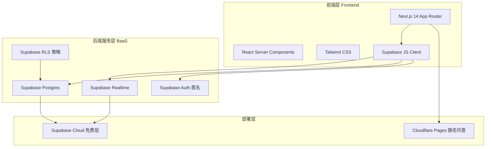
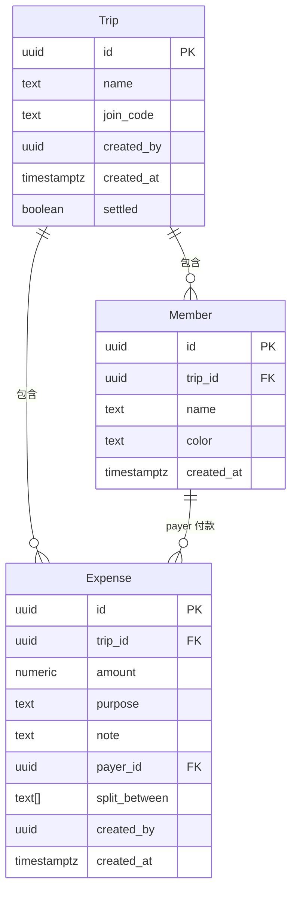

# 旅游分账 — 技术架构文档

## 1. 架构设计



## 2. 技术说明
- **前端框架**：Next.js 14.2.x（App Router）+ TypeScript
- **样式**：Tailwind CSS v3 + 手写组件（不使用 shadcn CLI）
- **状态管理**：React Context + useReducer（账本内全局状态）
- **后端 BaaS**：Supabase（PostgreSQL + Realtime + Auth）
- **实时同步**：Supabase Realtime postgres_changes 订阅
- **认证方式**：匿名认证 + 加入码（6 位大写字母数字），无密码无注册
- **数据持久化**：Supabase Postgres（云端唯一数据源）
- **离线缓存**：本地内存缓存，不持久化（依赖云端）
- **部署**：Cloudflare Pages 静态导出（output: 'export'）
- **包管理**：pnpm

## 3. 路由定义

| 路由 | 用途 |
|------|------|
| `/` | 首页：账本列表 + 创建/加入入口 |
| `/trip/[id]` | 账本详情页：成员 + 消费记录 |
| `/trip/[id]/add` | 添加消费页 |
| `/trip/[id]/settle` | 结算页：净额 + 转账方案 |
| `/trip/new` | 新建账本页 |
| `/trip/join` | 加入账本页（输入加入码） |

## 4. API / 数据访问层

不使用自建 API，全部通过 Supabase JS Client 直接访问。关键操作通过 RPC（PostgreSQL Function）保证原子性：

```typescript
// 类型定义
type Trip = {
  id: string
  name: string
  join_code: string  // 6 位加入码
  created_by: string
  created_at: string
  settled: boolean
}

type Member = {
  id: string
  trip_id: string
  name: string
  color: string  // 头像颜色
  created_at: string
}

type Expense = {
  id: string
  trip_id: string
  amount: number  // 单位：元，保留 2 位
  purpose: string  // 餐饮/住宿/交通/门票/购物/其他
  note: string  // 自定义备注
  payer_id: string  // 付款人 member_id
  split_between: string[]  // 分摊 member_id 数组
  created_by: string
  created_at: string
}

type Settlement = {
  from_member_id: string
  to_member_id: string
  amount: number
}
```

## 5. 数据库架构

### 5.1 ER 图



### 5.2 DDL

```sql
-- 账本表
CREATE TABLE trips (
  id UUID PRIMARY KEY DEFAULT gen_random_uuid(),
  name TEXT NOT NULL,
  join_code TEXT NOT NULL UNIQUE,
  created_by UUID,
  created_at TIMESTAMPTZ NOT NULL DEFAULT now(),
  settled BOOLEAN NOT NULL DEFAULT false
);

-- 成员表
CREATE TABLE members (
  id UUID PRIMARY KEY DEFAULT gen_random_uuid(),
  trip_id UUID NOT NULL REFERENCES trips(id) ON DELETE CASCADE,
  name TEXT NOT NULL,
  color TEXT NOT NULL,
  created_at TIMESTAMPTZ NOT NULL DEFAULT now()
);
CREATE INDEX idx_members_trip ON members(trip_id);

-- 消费记录表
CREATE TABLE expenses (
  id UUID PRIMARY KEY DEFAULT gen_random_uuid(),
  trip_id UUID NOT NULL REFERENCES trips(id) ON DELETE CASCADE,
  amount NUMERIC(12,2) NOT NULL CHECK (amount > 0),
  purpose TEXT NOT NULL DEFAULT '其他',
  note TEXT DEFAULT '',
  payer_id UUID NOT NULL REFERENCES members(id) ON DELETE CASCADE,
  split_between TEXT[] NOT NULL CHECK (array_length(split_between, 1) >= 1),
  created_by UUID,
  created_at TIMESTAMPTZ NOT NULL DEFAULT now()
);
CREATE INDEX idx_expenses_trip ON expenses(trip_id);
CREATE INDEX idx_expenses_payer ON expenses(payer_id);

-- RLS 策略：通过 join_code 关联，所有持有 trip_id 的客户端可读写
ALTER TABLE trips ENABLE ROW LEVEL SECURITY;
ALTER TABLE members ENABLE ROW LEVEL SECURITY;
ALTER TABLE expenses ENABLE ROW LEVEL SECURITY;

-- 简化策略：公开读写（通过加入码控制访问，适合 MVP）
CREATE POLICY "public_read_trips" ON trips FOR SELECT USING (true);
CREATE POLICY "public_write_trips" ON trips FOR ALL USING (true);
CREATE POLICY "public_read_members" ON members FOR SELECT USING (true);
CREATE POLICY "public_write_members" ON members FOR ALL USING (true);
CREATE POLICY "public_read_expenses" ON expenses FOR SELECT USING (true);
CREATE POLICY "public_write_expenses" ON expenses FOR ALL USING (true);
```

## 6. 核心算法

### 6.1 净额计算

```typescript
function calculateNet(trip: Trip, members: Member[], expenses: Expense[]) {
  const net: Record<string, number> = {}
  members.forEach(m => net[m.id] = 0)
  
  expenses.forEach(e => {
    const share = e.amount / e.split_between.length
    net[e.payer_id] += e.amount  // 付款人 +总
    e.split_between.forEach(mid => net[mid] -= share)  // 分摊人 -share
  })
  
  return net  // > 0 别人欠他；< 0 他欠别人
}
```

### 6.2 最少转账算法（贪心）

```typescript
function settleDebts(net: Record<string, number>): Settlement[] {
  const creditors: [string, number][] = []  // 净额 > 0
  const debtors: [string, number][] = []   // 净额 < 0
  
  Object.entries(net).forEach(([id, v]) => {
    if (v > 0.01) creditors.push([id, v])
    else if (v < -0.01) debtors.push([id, -v])
  })
  
  const result: Settlement[] = []
  let i = 0, j = 0
  while (i < debtors.length && j < creditors.length) {
    const pay = Math.min(debtors[i][1], creditors[j][1])
    result.push({ from_member_id: debtors[i][0], to_member_id: creditors[j][0], amount: pay })
    debtors[i][1] -= pay
    creditors[j][1] -= pay
    if (debtors[i][1] < 0.01) i++
    if (creditors[j][1] < 0.01) j++
  }
  return result
}
```

## 7. 实时同步实现

```typescript
// 订阅 trip 下所有变更
const channel = supabase
  .channel(`trip:${tripId}`)
  .on('postgres_changes',
    { event: '*', schema: 'public', table: 'expenses', filter: `trip_id=eq.${tripId}` },
    payload => refreshExpenses()
  )
  .on('postgres_changes',
    { event: '*', schema: 'public', table: 'members', filter: `trip_id=eq.${tripId}` },
    payload => refreshMembers()
  )
  .subscribe()
```

## 8. 文件结构

```
app/
  layout.tsx              # 根布局 + 全局样式 + 字体加载
  page.tsx                # 首页：账本列表
  globals.css             # Tailwind + 自定义变量
  trip/
    new/page.tsx          # 新建账本
    join/page.tsx         # 加入账本
    [id]/
      page.tsx            # 账本详情
      add/page.tsx        # 添加消费
      settle/page.tsx     # 结算页
components/
  TripCard.tsx            # 账本卡片
  MemberAvatar.tsx        # 成员头像
  ExpenseItem.tsx         # 消费记录条
  AmountInput.tsx         # 金额输入（大字号 + 数字键盘）
  MemberSelector.tsx      # 成员选择器（单选/多选）
  PurposeTag.tsx          # 消费目的标签
  SettlementCard.tsx      # 转账方案卡片
  NetSummary.tsx          # 净额汇总
  ExpenseMatrix.tsx       # 消费矩阵表
  EmptyState.tsx          # 空状态
  Header.tsx              # 顶部导航
lib/
  supabase.ts             # Supabase 客户端
  settle.ts               # 结算算法（净额 + 最少转账）
  constants.ts            # 颜色、目的标签等常量
  utils.ts                # 金额格式化等工具
types/
  index.ts                # 类型定义
public/
  paper-texture.svg       # 纸张纹理
  stamp.svg               # 邮戳装饰
next.config.mjs           # 静态导出配置
tailwind.config.ts        # 主题配色
```

## 9. 关键约束
- 金额单位：元（人民币 CNY），保留 2 位小数
- 分摊方式：均摊（后续可扩展按比例）
- 加入码：6 位大写字母数字（约 21 亿组合，够用）
- 成员颜色：从预设 8 色调色板循环分配
- 静态导出：`output: 'export'`，所有页面 client component
- Supabase URL/Key 通过 `NEXT_PUBLIC_` 前缀暴露给前端
